<!-- this is my try to read some of run data  -->
# Motive 
- Motive of this is to learn how to get data from CERN open data portal
- I tried to modify and made some changes in POET.
- I took Analyzers from POET only as I'm not that good in theory of what is important data and whats not.
- I've written configration file Ofcourse not from scratch.

# Result
- I choosed  [/SinglePhoton/Run2015D-16Dec2015-v1/MINIAOD](https://opendata.cern.ch/record/24118).
- from which I've used 
    - 1->link1
    	- (root://eospublic.cern.ch//eos/opendata/cms/Run2015D/SinglePhoton/MINIAOD/16Dec2015-v1/10000/0056501C-8AA8-E511-B8E2-0025905B858C.root)
    - 3->link2
    	- (root://eospublic.cern.ch//eos/opendata/cms/Run2015D/SinglePhoton/MINIAOD/16Dec2015-v1/10000/0072C927-8FA8-E511-A587-0026189438F7.root)
    - 4->link3
    	- (root://eospublic.cern.ch//eos/opendata/cms/Run2015D/SinglePhoton/MINIAOD/16Dec2015-v1/10000/009CE573-8EA8-E511-B071-0CC47A4D7694.root)
    - 5->link4
    	- (root://eospublic.cern.ch//eos/opendata/cms/Run2015D/SinglePhoton/MINIAOD/16Dec2015-v1/10000/009D4B46-68A9-E511-B5B2-00261894396B.root)

- I plotted the ele_pt (transversal momentum) > 10 GeV and ele_eta (pseudorapidity) 
- And also the same for muons for all 4 data.
- I tried to get multiple data except jets as I'm not able to understand anything in it

# following are the graphs that I got
#### Plots for Electrons transversal momentum and pseudorapidity
- Roo1.root
    

        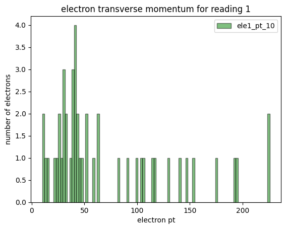
        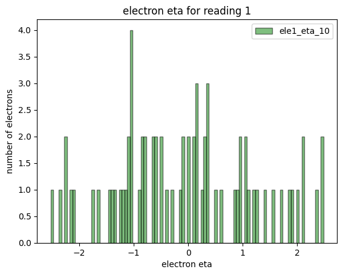
    

 - Roo3.root
    

        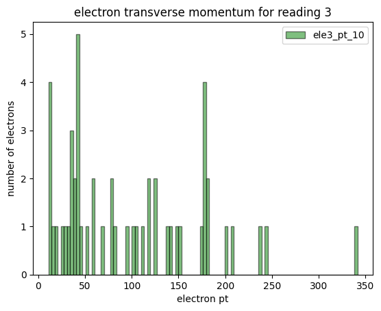
        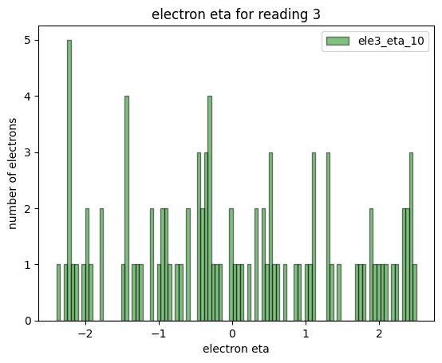
    

- Roo4.root

    

        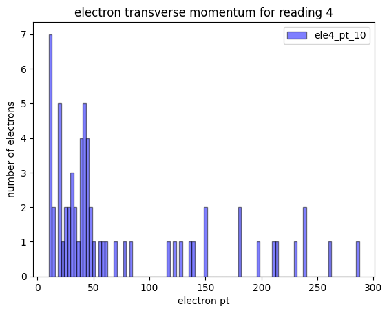
        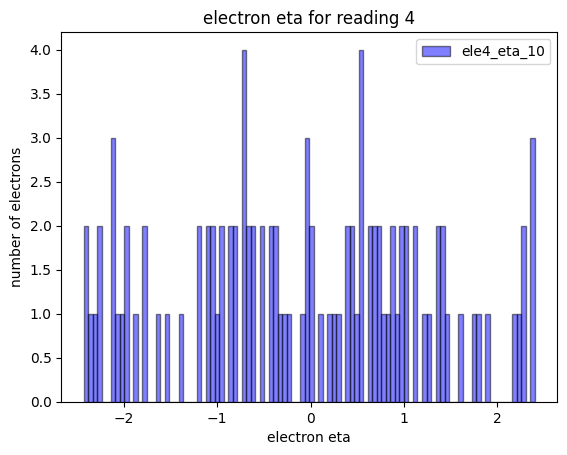
    

- Roo5.root

    

        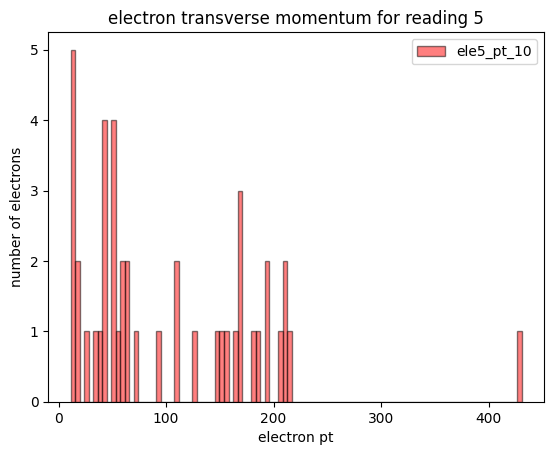
        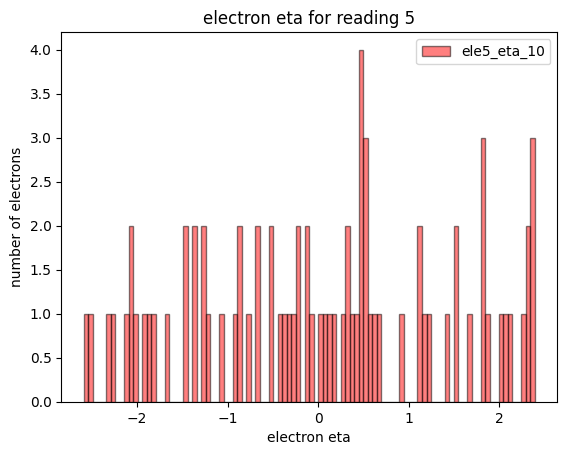
    

##### Similarly adding for muons
- Roo1.root
    

        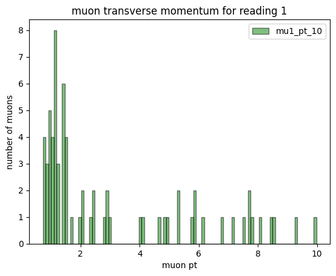
        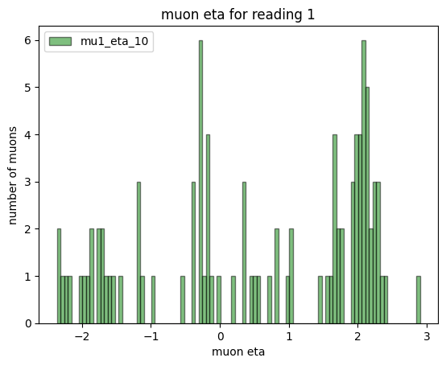
    

- Roo3.root
    

        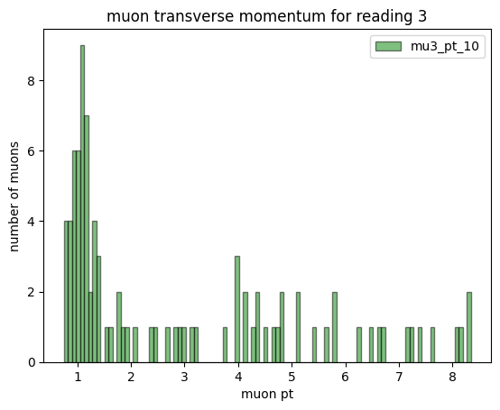
        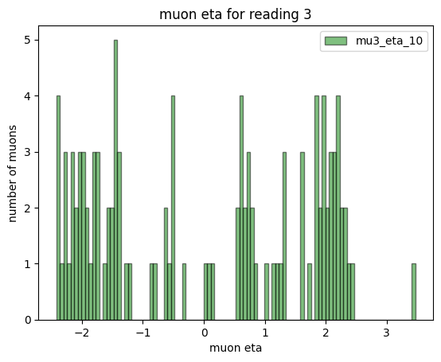
    

- Roo4.root
    

        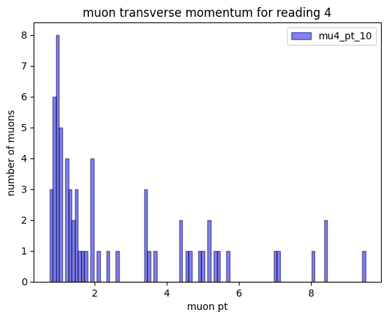
        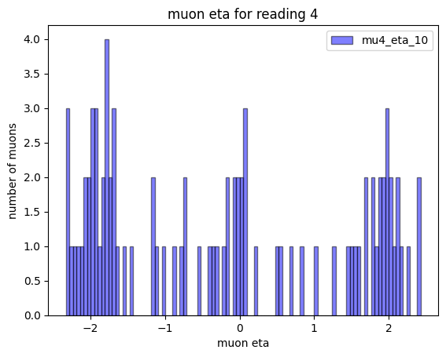
    

- Roo5.root
    

        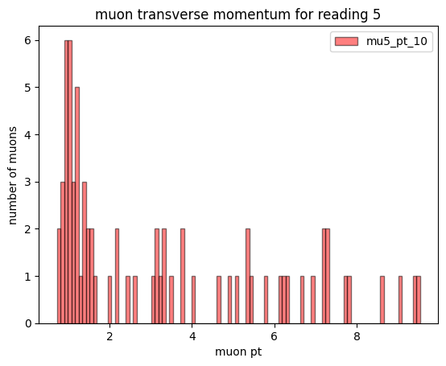
        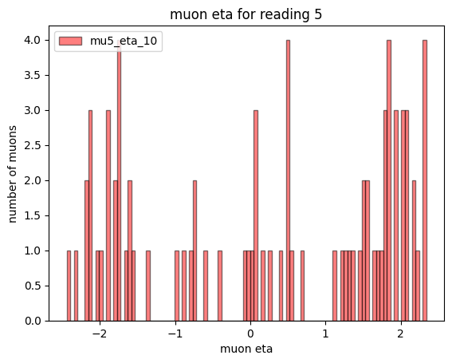
    

